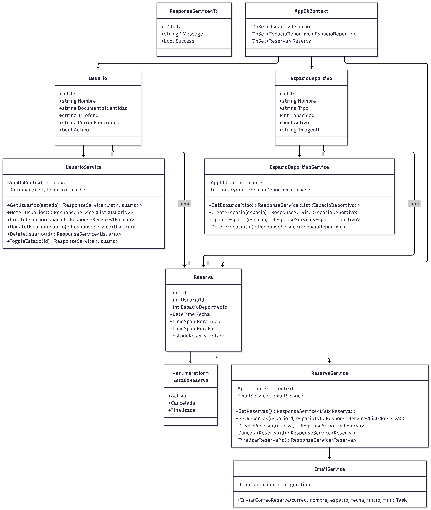
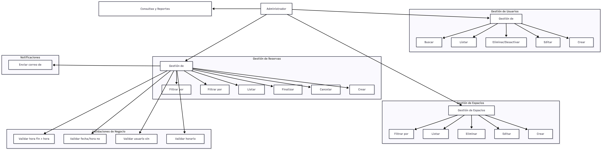

# 🏟️ Sports Sebastian Vargas - Sports Management System

Internal system to manage users, sports facilities, and reservations for a sports complex.

## 🚀 Technologies

- **Backend**: ASP.NET Core 10.0 (.NET)
- **Frontend**: HTML, Tailwind CSS, Material Symbols
- **Database**: PostgreSQL
- **ORM**: Entity Framework Core 9.0
- **Email**: MailKit (SMTP)

## 📋 Requirements

- .NET SDK 10.0
- PostgreSQL 15+

## ⚡ Installation

### 1. Clone the project
```bash
git clone https://github.com/Zain-wave/CSharp-Sport-Performance-Test.git
cd CSharp-Sport-Performance-Test/Sports-Sebastian-Vargas
```

### 2. Configure database

#### In PostgreSQL (local or server):
```sql
CREATE DATABASE sports_db;
```

Connection data is in `appsettings.json`:
```json
{
  "ConnectionStrings": {
    "DefaultConnection": "Host=localhost;Database=sports_db;Username=postgres;Password=YOUR_PASSWORD"
  }
}
```

### 3. Run
```bash
dotnet run --project Sports-Sebastian-Vargas.csproj --urls "http://localhost:5000"
```

## 🌐 Endpoints

| Route | Description |
|------|----------|
| `/` | Home page |
| `/Usuario` | User management |
| `/EspacioDeportivo` | Facility management |
| `/Reserva` | Reservation management |

## 📱 Features

### Users
- ✅ Register/edit/delete users
- ✅ Filter by status (Active/Inactive)
- ✅ Search by name
- ✅ Activate/deactivate user (Toggle)
- ✅ When deactivating, active reservations are automatically cancelled

### Sports Facilities
- ✅ Register/edit/delete facilities
- ✅ Filter by type
- ✅ Images by URL
- ✅ Validate unique name

### Reservations
- ✅ Create reservations
- ✅ Validate schedule (no overlap)
- ✅ Cancel/Finish reservations
- ✅ Filter by user (name or ID)
- ✅ Filter by facility

### Notifications
- ⚠️ Email configured but without credentials only simulated

## 📁 Project Structure

```
Sports-Sebastian-Vargas/
├── Controllers/           # MVC Controllers
├── Data/                 # DbContext
├── Models/               # Entities
│   └── Enums/           # Enumerations
├── Services/             # Business Logic
├── ViewModels/           # View Models
├── Views/                # Razor Views
│   ├── Usuario/
│   ├── EspacioDeportivo/
│   ├── Reserva/
│   └── Shared/         # Layout
├── wwwroot/            # Static files
├── diagrama-clases.png   # Class diagram
├── diagrama-casos-uso.png # Use case diagram
└── README.md          # This file
```

## 🏗️ Project Architecture

The project follows the **MVC (Model-View-Controller)** pattern:

- **Models**: Entities (Usuario, Reserva, EspacioDeportivo)
- **Views**: Razor pages with Tailwind CSS
- **Controllers**: Handle HTTP requests and routing
- **Services**: Business logic (UsuarioService, ReservaService, EspacioDeportivoService, EmailService)

## 📊 Diagrams

### Class Diagram


### Use Case Diagram


## 📝 Sample Data

When running for the first time, the following are automatically created:
- 3 sample users
- 3 sports facilities
- 3 sample reservations

## 🔐 Security Notes

- PostgreSQL password is in plain text in `appsettings.json` (not recommended for production)
- SMTP credentials are empty (to enable emails, configure Gmail or another provider)

## 📄 License

MIT License

## 👤 Author

Sebastian Vargas Ramirez